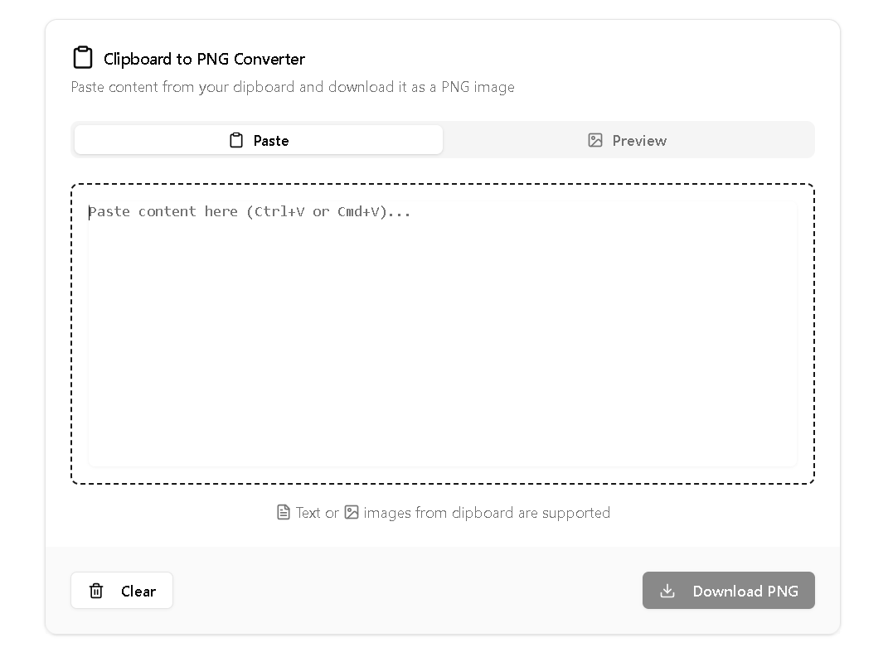

# 🖼️ Paste2Image

**Paste clipboard content. Preview it. Download it as a PNG.**

A lightweight web app built with [Next.js](https://nextjs.org/), [shadcn/ui](https://ui.shadcn.com/), and [Tailwind CSS](https://tailwindcss.com/). Perfect for turning code snippets, text, or notes into shareable images in seconds.



## ✨ Features

-   📋 Paste directly from your clipboard
-   🧩 Styled live preview with responsive layout
-   📷 Export to PNG using `html2canvas`
-   💡 Simple, clean interface built with `shadcn/ui` components
-   🎨 Easily customizable with Tailwind CSS

## 🧱 Tech Stack

-   **Next.js** – App router, fast builds, SSR
-   **Tailwind CSS** – Utility-first CSS framework
-   **shadcn/ui** – Beautiful, accessible UI components
-   **html2canvas** – DOM to image rendering

## 🚀 Getting Started

### 1. Clone the repository

```bash
git clone https://github.com/azkriven16/paste2image.git
cd paste2image

npm install

npm run dev
```

## Open http://localhost:3000 in your browser
